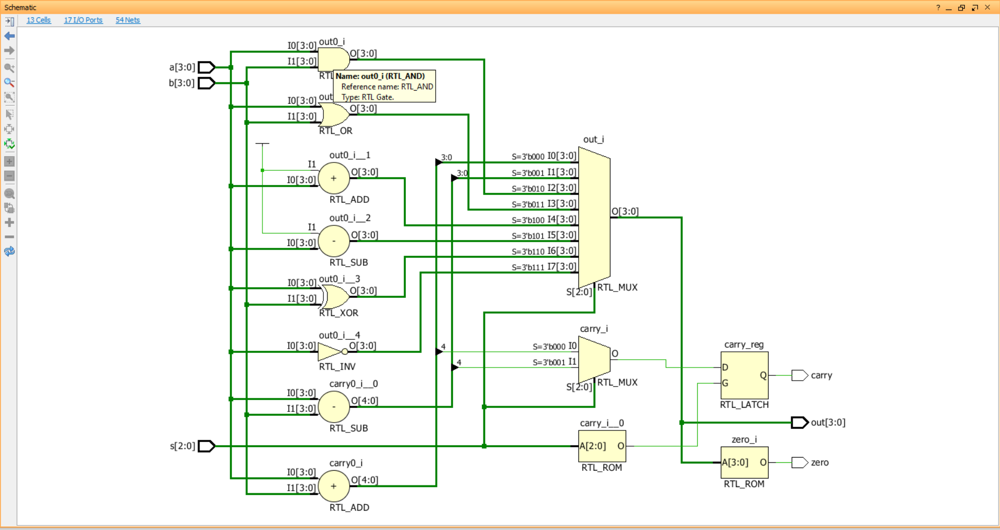
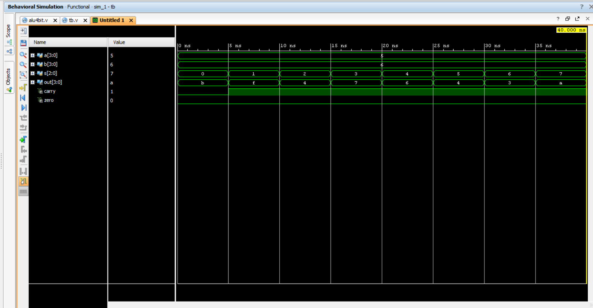

# 4-bit-alu-verilog
4-bit alu design using Verilog HDL and simulated in Xilinx Vivado with waveform verification
# 4-bit ALU Verilog

This project implements a 4-bit Arithmetic Logic Unit (ALU) using Verilog HDL and simulated in Xilinx Vivado.

## Features
- 4-bit Arithmetic and Logic Operations
- Designed using Verilog HDL
- Simulated and verified in Xilinx Vivado

## Operations Supported
- Addition
- Subtraction
- AND
- OR
- XOR

## Tools Used
- Verilog HDL
- Xilinx Vivado Simulator

## RTL Design
RTL schematic generated using Vivado:

## Simulation Waveform
Functional verification waveform:

